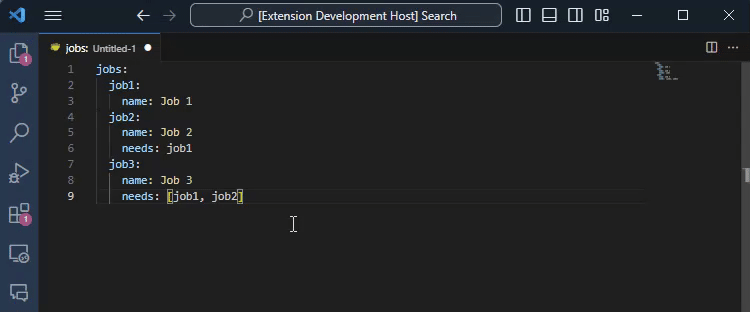

# ACTIONS TO GRAPH


```actions-to-graph``` is a Visual Studio Code extension that allows you to generate a graph from a yaml/yml file with github action workflow.

This extension:
- Supports both YAML 1.1 and YAML 1.2.
- Supports YAML with comments.
- The library is released under the ISC open source license, and the code is [available on Github](https://github.com/oscarBack/actions-to-graph)

## Features
- Generate a graph with mermaid syntax in a new `graph.md` file.


## Testing
### Running locally
- Position on `src/extension.ts` and press `F5` to run the extension locally.

### Running pool of tests
- Build the devcontainer with the extension `Dev Containers`
- Run the tests with `npm run test`

## License
This project is licensed under the terms of the [MIT license](LICENSE).