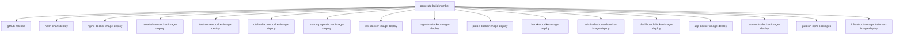

```mermaid
graph TD;
  generate-build-number["generate-build-number"];
  github-release["github-release"]
  generate-build-number["generate-build-number"] --> github-release;
  helm-chart-deploy["helm-chart-deploy"]
  generate-build-number["generate-build-number"] --> helm-chart-deploy;
  nginx-docker-image-deploy["nginx-docker-image-deploy"]
  generate-build-number["generate-build-number"] --> nginx-docker-image-deploy;
  isolated-vm-docker-image-deploy["isolated-vm-docker-image-deploy"]
  generate-build-number["generate-build-number"] --> isolated-vm-docker-image-deploy;
  test-server-docker-image-deploy["test-server-docker-image-deploy"]
  generate-build-number["generate-build-number"] --> test-server-docker-image-deploy;
  otel-collector-docker-image-deploy["otel-collector-docker-image-deploy"]
  generate-build-number["generate-build-number"] --> otel-collector-docker-image-deploy;
  status-page-docker-image-deploy["status-page-docker-image-deploy"]
  generate-build-number["generate-build-number"] --> status-page-docker-image-deploy;
  test-docker-image-deploy["test-docker-image-deploy"]
  generate-build-number["generate-build-number"] --> test-docker-image-deploy;
  ingestor-docker-image-deploy["ingestor-docker-image-deploy"]
  generate-build-number["generate-build-number"] --> ingestor-docker-image-deploy;
  probe-docker-image-deploy["probe-docker-image-deploy"]
  generate-build-number["generate-build-number"] --> probe-docker-image-deploy;
  haraka-docker-image-deploy["haraka-docker-image-deploy"]
  generate-build-number["generate-build-number"] --> haraka-docker-image-deploy;
  admin-dashboard-docker-image-deploy["admin-dashboard-docker-image-deploy"]
  generate-build-number["generate-build-number"] --> admin-dashboard-docker-image-deploy;
  dashboard-docker-image-deploy["dashboard-docker-image-deploy"]
  generate-build-number["generate-build-number"] --> dashboard-docker-image-deploy;
  app-docker-image-deploy["app-docker-image-deploy"]
  generate-build-number["generate-build-number"] --> app-docker-image-deploy;
  accounts-docker-image-deploy["accounts-docker-image-deploy"]
  generate-build-number["generate-build-number"] --> accounts-docker-image-deploy;
  publish-npm-packages["publish-npm-packages"]
  generate-build-number["generate-build-number"] --> publish-npm-packages;
  infrastructure-agent-docker-image-deploy["infrastructure-agent-docker-image-deploy"]
  generate-build-number["generate-build-number"] --> infrastructure-agent-docker-image-deploy;
```